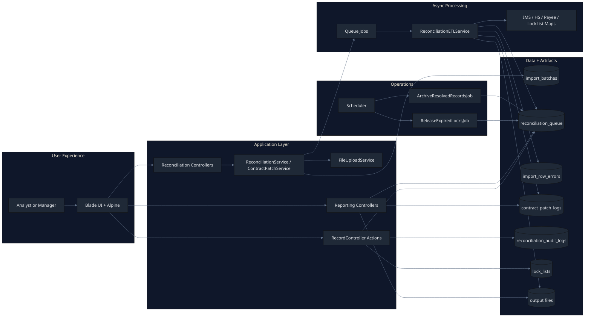
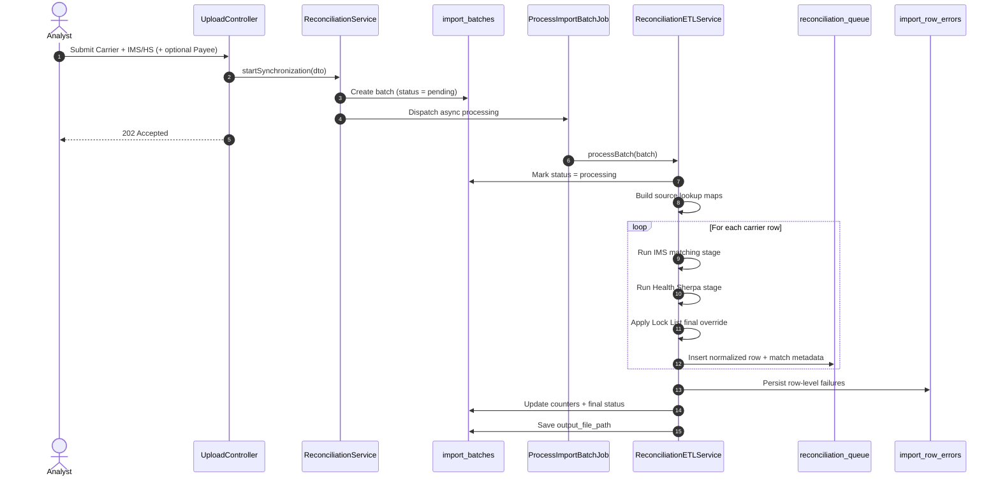
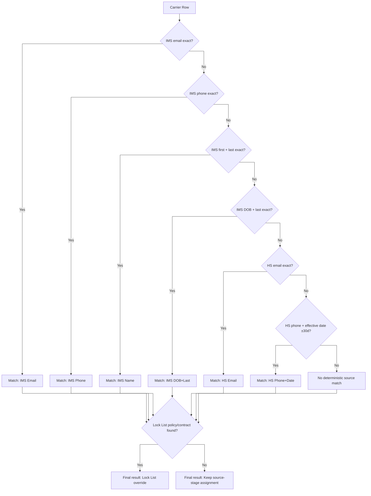
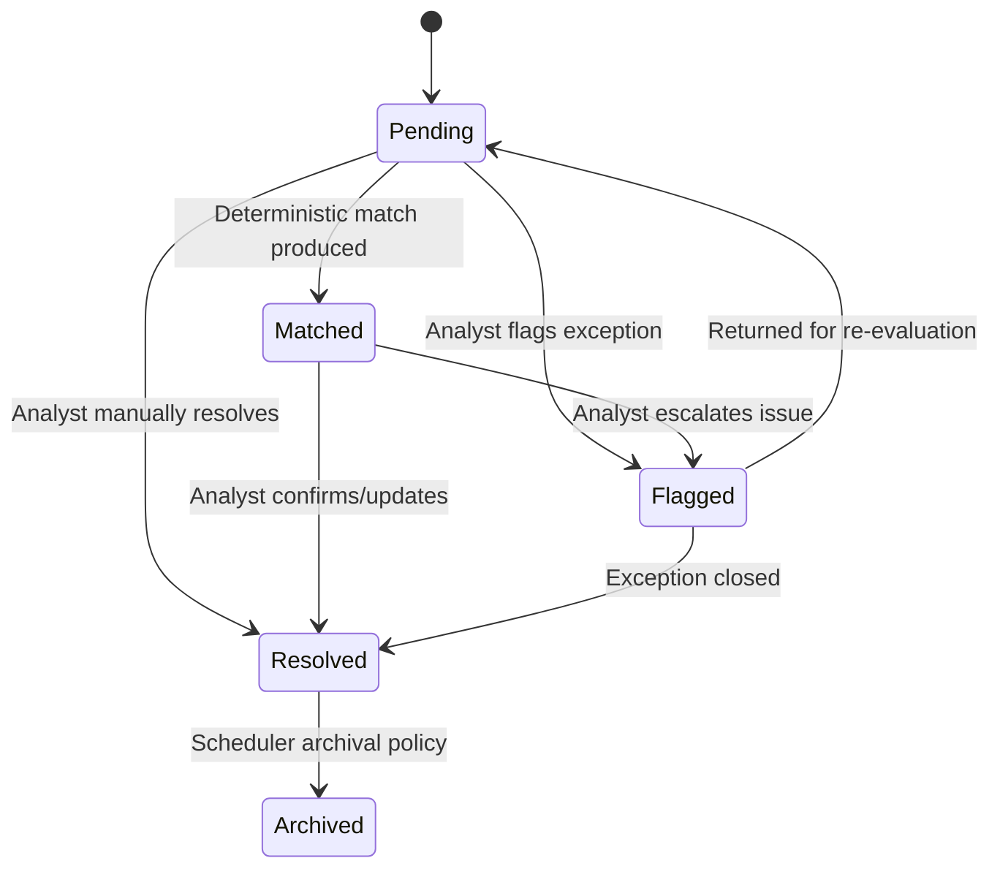
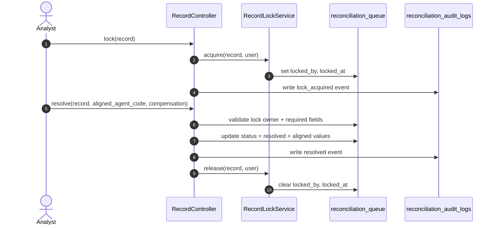
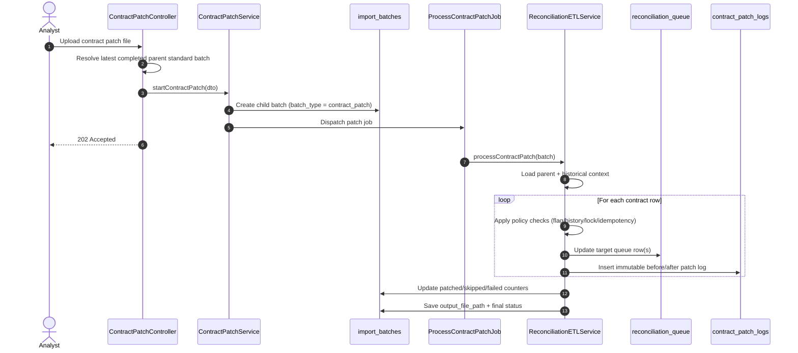
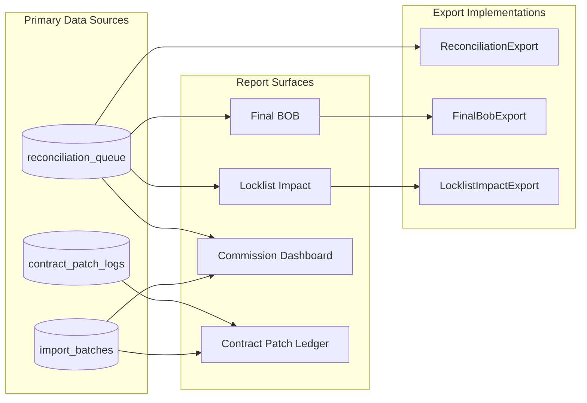
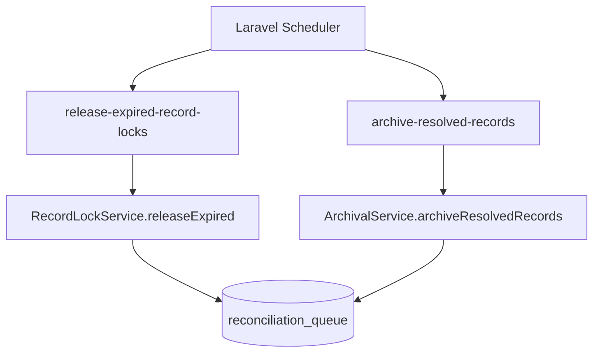
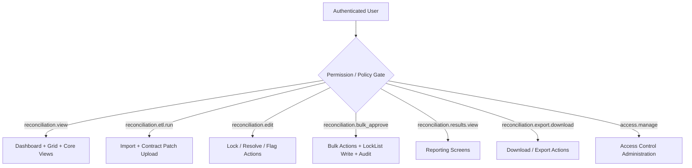

# BOB Reconciliation Hub
## Flow Diagrams

Version: 2026-04-08

This page was redesigned for readability:
- Each diagram follows one clear story.
- Colors and grouping are consistent.
- Technical details are kept, but visual noise is reduced.

## 1) End-to-End System Architecture
Use this as the master map of how UI, services, jobs, and storage connect.

## 2) Standard Synchronization Flow
This shows the lifecycle of a normal upload run from submit to output generation.

## 3) Deterministic Matching Decision Path
Decision order is strict: IMS first, then Health Sherpa, then Lock List override.

## 4) Record Review Lifecycle
This is the analyst-facing state lifecycle once records are in the queue.

## 5) Lock and Resolve Interaction
Shows lock ownership enforcement before a resolve operation is accepted.

## 6) Contract Patch Processing Flow
Contract patch runs are child runs that update rows under a completed parent standard batch.

## 7) Reporting Data Lineage
Use this to explain where each reporting page gets its data.

## 8) Scheduler and Operations Flow
Operational maintenance runs independently of analyst actions.

## 9) Permission Gate to Screen Access
This view maps permission checks to visible functional areas.

